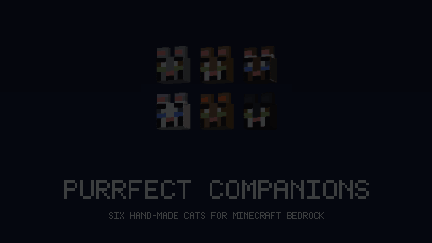

# Purrfect Companions

Minecraft **Bedrock** add-on: four hand-made cats you can tame, ride, breed and dress up.

[CurseForge](https://www.curseforge.com/minecraft-bedrock/addons/purrfect-companions) · [MCPEDL](https://mcpedl.com/purrfect-companions/) · [purrfect.pelleops.se](https://purrfect.pelleops.se)

---

## The cats

| Entity | Name | Breed | Look | Scale |
|---|---|---|---|---|
| `mjau:misty` | Misty | Siberian | Grey tabby, green eyes | 1.0 |
| `mjau:hazel` | Hazel | Siberian | Brown-and-white tabby, white bib and paws | 1.0 |
| `mjau:mocha` | Mocha | Sacred Birman | White with brown points, white gloves, belly stripes, blue eyes | 0.85 |
| `mjau:snow` | Snow | Ragdoll | All white, blue eyes | 1.15 |

Each meows in its own pitch — Mocha highest, Snow deepest.

## Features

- **Tame** with cod, salmon or a crafted Cat Treat → they follow you
- **Sit** on interact once tamed (empty hand)
- **Ride** when saddled: hold a saddle → interact → interact again. ~56 % faster, charged jump. The saddle is visible on their back
- **Breed** with fish → a kitten of the **same breed**, half size, which grows up
- **Gifts** — tamed cats bring presents in the morning
- **Carries for you** — a cat in a backpack has a real 15-slot hold, picks up
  what you drop or mine within 4 blocks, and hands the load over when you
  sneak up beside her
- **Warns you** — she bristles and calls out when something hostile closes in
  from 8–16 blocks away
- **Creepers and phantoms flee** from them (they carry the `cat` family)
- They **stalk and pounce** on rabbits and chickens
- **Spawn naturally** in plains biomes
- **Spawn eggs show cat faces**, not eggs
- **Animated**: walk cycle with legs in diagonal pairs, swaying tail, head tracking, curled-up sitting pose

## Blocks

| Block | Recipe |
|---|---|
| **Cat Bed** | 3 wool + 3 leather |
| **Yarn Ball** | 8 string + 1 wool |

Cats seek both out on their own (`minecraft:behavior.move_to_block`).

## Outfits

Craftable, applied to a tamed cat, and all wearable at the same time.

| Outfit | Colours | Recipe |
|---|---|---|
| **Cat Saddle** | brown, black, light | 3 leather + 2 string (+ dye). A vanilla saddle gives brown |
| **Cat Cap** | cyan, red, green, yellow | 3 wool + 1 leather |
| **Cat Scarf** | red, blue, green, yellow | 4 wool |
| **Cat Backpack** | brown, green, blue | 5 leather + 2 string + dye. **Holds 15 slots**, auto-collects nearby drops, gives them back when you sneak beside her |
| **Cat Glasses** | black, gold, pink | 2 glass panes + dye or gold nugget |
| **Cat Cape** | red, blue, purple, black | 6 wool + 2 string |
| **Cat Booties** | white, black, red, yellow | 4 wool in the corners — one on each paw |
| **Cat Collar** | red, blue, green | 3 wool + 1 iron nugget (bell) |
| **Cat Bow** | pink, red, blue, yellow | 3 wool |
| **Cat Wings** | white, black, gold | 4 feathers + colour material |
| **Cat Crown** | gold, silver | 5 ingots + 1 emerald |
| **Cat Cart** | wood, red, blue | 3 planks + 2 sticks + 2 slabs. Adds a **second seat** — a friend rides along |

**Cat Treat** — cod + wheat, works as a taming treat.

---

## How it is built

Almost nothing in the two packs is written by hand. Three generators emit the
JSON, the geometry and the textures from small tables at the top of each file,
so adding an outfit colour is a one-line change rather than a dozen edits kept
manually in sync.

| Script | Owns |
|---|---|
| `build_accessories.py` | Outfits: geometry, textures, render controllers, entity properties and events, interactions, items, icons, recipes, language keys |
| `build_blocks.py` | Cat Bed and Yarn Ball, plus the behaviour that makes cats seek them out |
| `render_preview.py` | The preview images, with a small z-buffered renderer — no image library required |
| `make_variant.py` | Rewrites the pack into its public naming, with its own pack UUIDs |

Textures are written by a short pure-`zlib` PNG writer, so the whole toolchain
runs on a stock Python install.

## Testing

`purrfect-test` validates the packs and then runs them for real: it boots a
Bedrock dedicated server, spawns every cat, fires every outfit event and checks
with `has_property` that the cat's state actually changed — not merely that the
command was accepted.

The static half encodes the mistakes this add-on has already made, so none of
them can come back:

- a texture whose declared size no longer matches the actual PNG
- `has_equipment` filters missing the `mjau:` namespace, which silently makes an
  outfit impossible to equip
- an entity property read by a render controller but missing `client_sync`, so
  the server knows about the outfit and the client never draws it
- a translation key referenced but never defined, which shows the player the raw
  key instead of a word
- icons or textures a variant renamed but forgot to re-register
- duplicate behaviour priorities, conflicting scales, wrong saddle seat height

On top of the static half sit three live layers: a real Bedrock Dedicated
Server run (spawns, events, block placement, cart cargo via `replaceitem`),
a real network client (`bedrock-protocol`) that joins as a player and checks
the item registry, `/give`, entity streaming and property syncs — and a
**simulated player** (Mojang's GameTest framework) that tames a cat by feeding
it cod, saddles it through the ownership and held-item filters, mounts it and
steers it, measuring that the cat actually moves.

What the suite deliberately does **not** claim: whether a player can open the
built-in container window. A real client failed to open one — and failed on a
chest-carrying vanilla donkey in the same run, which is why the backpack hands
its load over on a sneak instead of relying on that window. The gesture is the
same one the progress report uses, proven on real Xbox; neither the network bot
nor a simulated player can raise `isSneaking`, so `tools/testbot/container-test.js`
reports *inconclusive* (exit 2) rather than a false failure.

`purrfect-ship` packages and uploads, refuses to run if the test is red, and
keeps a ledger so the same version can never ship twice with different
content.
