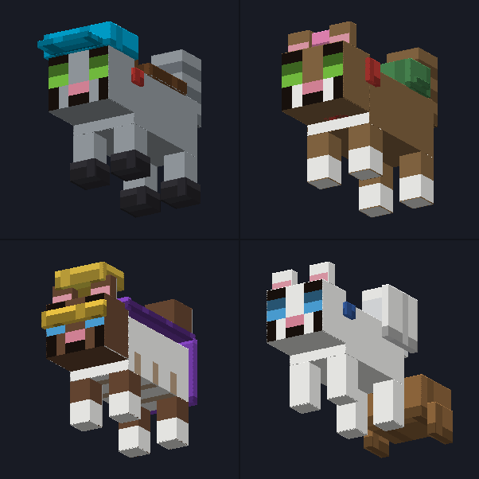

# Purrfect Companions

Minecraft **Bedrock** add-on: four hand-made cats you can tame, ride, breed and dress up.

By **Pellzor** · free to use — see [LICENSE.txt](LICENSE.txt)
[CurseForge](https://www.curseforge.com/minecraft-bedrock/addons/purrfect-companions) · [purrfect.pelleops.se](https://purrfect.pelleops.se)


---

## The cats

| Entity | Name | Breed | Look | Scale |
|---|---|---|---|---|
| `mjau:misty` | Misty | Siberian | Grey tabby, green eyes | 1.0 |
| `mjau:hazel` | Hazel | Siberian | Brown-and-white tabby, white bib and paws | 1.0 |
| `mjau:mocha` | Mocha | Sacred Birman | White with brown points, white gloves, belly stripes, blue eyes | 0.85 |
| `mjau:snow` | Snow | Ragdoll | All white, blue eyes | 1.15 |

Each meows in its own pitch — Mocha highest, Snow deepest.

## Features

- **Tame** with cod, salmon or a crafted Cat Treat → they follow you
- **Sit** on interact once tamed (empty hand)
- **Ride** when saddled: hold a saddle → interact → interact again. ~56 % faster, charged jump. The saddle is visible on their back
- **Breed** with fish → a kitten of the **same breed**, half size, which grows up
- **Gifts** — tamed cats bring presents in the morning
- **Creepers and phantoms flee** from them (they carry the `cat` family)
- They **stalk and pounce** on rabbits and chickens
- **Spawn naturally** in plains biomes
- **Spawn eggs show cat faces**, not eggs
- **Animated**: walk cycle with legs in diagonal pairs, swaying tail, head tracking, curled-up sitting pose

## Blocks

| Block | Recipe |
|---|---|
| **Cat Bed** | 3 wool + 3 leather |
| **Yarn Ball** | 8 string + 1 wool |

Cats seek both out on their own (`minecraft:behavior.move_to_block`).

## Outfits

Craftable, applied to a tamed cat, and all wearable at the same time.

| Outfit | Colours | Recipe |
|---|---|---|
| **Cat Saddle** | brown, black, light | 3 leather + 2 string (+ dye). A vanilla saddle gives brown |
| **Cat Cap** | cyan, red, green, yellow | 3 wool + 1 leather |
| **Cat Scarf** | red, blue, green, yellow | 4 wool |
| **Cat Backpack** | brown, green, blue | 5 leather + 2 string + dye |
| **Cat Glasses** | black, gold, pink | 2 glass panes + dye or gold nugget |
| **Cat Cape** | red, blue, purple, black | 6 wool + 2 string |
| **Cat Booties** | white, black, red, yellow | 4 wool in the corners — one on each paw |
| **Cat Collar** | red, blue, green | 3 wool + 1 iron nugget (bell) |
| **Cat Bow** | pink, red, blue, yellow | 3 wool |
| **Cat Wings** | white, black, gold | 4 feathers + colour material |
| **Cat Crown** | gold, silver | 5 ingots + 1 emerald |
| **Cat Cart** | wood, red, blue | 3 planks + 2 sticks + 2 slabs. Adds a **second seat** — a friend rides along |

**Cat Treat** — cod + wheat, works as a taming treat.

## Two variants

The source is the **public** version (generic names: Misty, Hazel, Mocha, Snow).
A **private** variant with different cat names is generated at packaging time by
`make_variant.py`, reading `variants.private.json` — which is gitignored, so those
names never enter the repository.

The variants deliberately use **different pack UUIDs**; identical UUIDs would make
them overwrite each other in Minecraft's pack list. Both can be installed together.

## Workflow

```bash
purrfect-test --quick             # validation only (~2 s)
purrfect-test                     # + live test in a Bedrock server (~1 min)
purrfect-ship                     # build the private variant
purrfect-ship --public            # public variant
purrfect-ship --curseforge        # public variant → CurseForge
purrfect-ship --bump minor        # bump version first (major|minor|patch)
python3 build_accessories.py      # regenerate outfits
python3 build_blocks.py           # regenerate blocks
python3 render_preview.py         # marketing images + logo → publish/
```

`purrfect-ship` **refuses to ship if the test fails**, and verifies the checksum
after upload. The filename is derived from the pack name in the manifest.

Everything — outfits, blocks, geometry, textures, icons, recipes, language strings —
is generated from single definitions at the top of `build_accessories.py` and
`build_blocks.py`. **Do not edit generated files by hand**; they are overwritten.

## Layout

```
PurrfectCompanions_BP/     behaviour pack — entities, blocks, items, recipes, loot, spawn rules
PurrfectCompanions_RP/     resource pack — models, textures, animations, sounds, icons
build_accessories.py       outfits, from one ACC table
build_blocks.py            blocks, from one BLOCKS table
make_variant.py            builds a named variant as a transformed copy
render_preview.py          isometric renderer for previews (pure stdlib, no PIL)
md2html.py                 markdown → HTML for storefront descriptions
```
